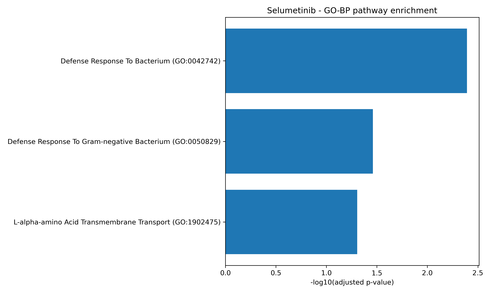

# Drug Response Prediction from Transcriptomic Profiles

Machine learning pipeline for predicting **cancer drug response (IC50)** from **gene expression data**, followed by **biological pathway enrichment analysis** to interpret model features.

This project demonstrates how **machine learning models trained on transcriptomic data can identify biologically meaningful pathways associated with drug sensitivity.**

---

# Project Overview

This repository implements a reproducible bioinformatics pipeline that:

1. Integrates **transcriptomic data with pharmacological response measurements**
2. Trains an **ElasticNet regression model** to predict drug sensitivity
3. Extracts genes driving model predictions
4. Performs **pathway enrichment analysis**
5. Produces interpretable biological results and visualizations

The workflow is demonstrated using the MEK inhibitor **Selumetinib**.

---

# Analysis Pipeline

The full pipeline is shown below.

```
Gene Expression Data
        │
        ▼
Drug Response Integration
        │
        ▼
Per-Drug Dataset Generation
        │
        ▼
ElasticNet Model Training
        │
        ▼
Feature Selection
(non-zero coefficients)
        │
        ▼
Gene List Extraction
        │
        ▼
Pathway Enrichment Analysis
(KEGG / Reactome / GO)
        │
        ▼
Biological Interpretation
```

---

# Data Sources

This project uses publicly available pharmacogenomics datasets derived from large-scale cancer cell line screens such as:

- **GDSC (Genomics of Drug Sensitivity in Cancer)**
- **CCLE (Cancer Cell Line Encyclopedia)**

These resources provide:

- genome-wide gene expression profiles
- drug response measurements (IC50)
- hundreds of cancer cell lines

For each drug, the pipeline builds a **per-drug dataset linking gene expression with drug response.**

---

# Machine Learning Model

Drug response prediction is performed using **ElasticNet regression**.

ElasticNet is suitable for transcriptomic data because it:

- performs **automatic feature selection**
- handles **high-dimensional gene expression data**
- reduces model overfitting via **regularisation**

Model evaluation metrics:

- **R²**
- **RMSE**

Example result (Selumetinib):

```
R²   = 0.52
RMSE = 1.30
```

Model outputs:

```
results/models/<drug>_elasticnet.joblib
results/metrics/<drug>_elasticnet_metrics.json
```

---

# Feature Selection

Genes with **non-zero ElasticNet coefficients** are interpreted as predictors of drug response.

Two feature tables are generated:

```
results/metrics/<drug>_elasticnet_top_features.csv
results/metrics/<drug>_elasticnet_all_nonzero_features.csv
```

These genes are then converted into a clean **gene symbol list** for pathway analysis.

---

# Pathway Enrichment Analysis

Gene lists are analysed using **Enrichr via gseapy**.

Databases queried:

- **KEGG**
- **Reactome**
- **Gene Ontology (Biological Process)**

Output tables:

```
results/enrichment/<drug>_kegg_enrichment.csv
results/enrichment/<drug>_reactome_enrichment.csv
results/enrichment/<drug>_gobp_enrichment.csv
```

Significant results:

```
results/enrichment/*_enrichment_sig.csv
```

---

# Example Result (Selumetinib)

Pathway enrichment identified a significant biological process:

```
Defense Response To Gram-negative Bacterium
Adjusted p-value = 0.00618
```

Genes contributing to this signal:

```
IL23A
DEFA4
DEFA3
CTSG
DEFA1
LYZ
TLR4
LYPD8
```

These genes are involved in **innate immune signalling and inflammatory responses**, suggesting that immune-associated transcriptional programs may influence Selumetinib sensitivity across cancer cell lines.

---

# Visualization

Pathway enrichment results are visualised as **bar plots of –log10(adjusted p-values)**.

Example outputs:

```
results/plots/selumetinib_kegg_barplot.png
results/plots/selumetinib_reactome_barplot.png
results/plots/selumetinib_gobp_barplot.png
```

Example figure:



---

# Repository Structure

```
drug-response-prediction-ML

config/
    default_config.yaml

data/
    processed/

scripts/
    04_train_elasticnet_model.py
    05_extract_gene_symbols.py
    06_run_pathway_enrichment.py
    07_plot_enrichment_results.py

results/
    enrichment/
    metrics/
    models/
    plots/
```

---

# Example Usage

### Train the model

```bash
python scripts/04_train_elasticnet_model.py \
--config config/default_config.yaml \
--drug "Selumetinib"
```

### Extract gene symbols

```bash
python scripts/05_extract_gene_symbols.py \
--drug "Selumetinib" \
--source all_nonzero_features \
--top_n 250
```

### Run pathway enrichment

```bash
python scripts/06_run_pathway_enrichment.py \
--drug "Selumetinib" \
--source all_nonzero_features \
--top_n 250
```

### Generate enrichment plots

```bash
python scripts/07_plot_enrichment_results.py \
--drug "Selumetinib"
```

---

# Reproducibility

Create the required environment:

```
conda create -n drug_response_env python=3.11
conda activate drug_response_env
pip install pandas numpy scikit-learn matplotlib gseapy pyyaml joblib
```

---

# Technologies Used

Python ecosystem:

- pandas
- numpy
- scikit-learn
- matplotlib
- gseapy
- PyYAML
- joblib

Bioinformatics areas:

- transcriptomics
- pharmacogenomics
- pathway enrichment
- machine learning for omics data

---

# Future Improvements

Potential extensions of this project include:

- training models for multiple drugs
- benchmarking additional algorithms (Random Forest, XGBoost)
- SHAP feature importance analysis
- multi-omics integration (mutation + expression)
- cross-drug prediction models

---

# Why This Project Matters

Predicting drug response from molecular data is a key challenge in **precision oncology**.

This project demonstrates how:

- machine learning can model drug sensitivity from transcriptomic data
- feature selection can identify biologically meaningful genes
- pathway enrichment can translate predictive models into **biological insight**

Such approaches contribute to the development of **computational methods for personalised cancer therapy**.